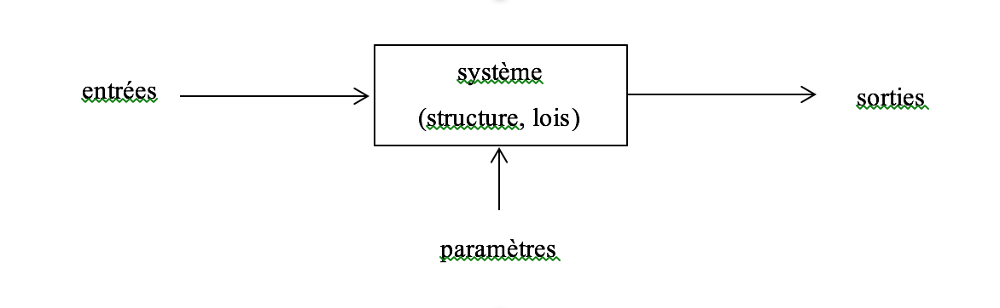

# I.1	Définition des modèles hydrogéologiques

Le terme « modèle » \(de l’italien modello, du latin modulus, signifiant mesure\) renvoie à l’origine aux représentations à échelle réduite. Il désigne ensuite ce qui est donné pour servir de référence puis prend une connotation plus scientifique au milieu du XXème siècle, avec l’apparition des termes dérivés « modéliser » et « modélisation ». L’évolution des modèles hydrogéologiques suit la même direction : des premières maquettes reproduisant des aquifères en modèles réduits, les scientifiques sont passés à l’utilisation de logiciels informatiques grâce à l’évolution fulgurante de la vitesse de calcul des micro-ordinateurs depuis les années 1970.

D’après le Dictionnaire français d'Hydrogéologie, la définition d’un « modèle hydrogéolo­gique » est la suivante : « Toute représentation théorique simplifiée d'un système aquifère : elle comporte la définition d'une structure, la formulation de lois \(relations déterministes ou probabilistes\) reliant les impulsions ou entrées du système à ses réponses ou sorties, et la dé­finition des paramètres \(constantes ou variables pouvant prendre des valeurs numériques\) entrant dans ces relations. \[...\] » \(Figure I‑1\).

Test équation

$$
S(t)= (E*H)(t)=\int_{0}^{t}E(\tau).H(t-\tau).d\tau
$$

